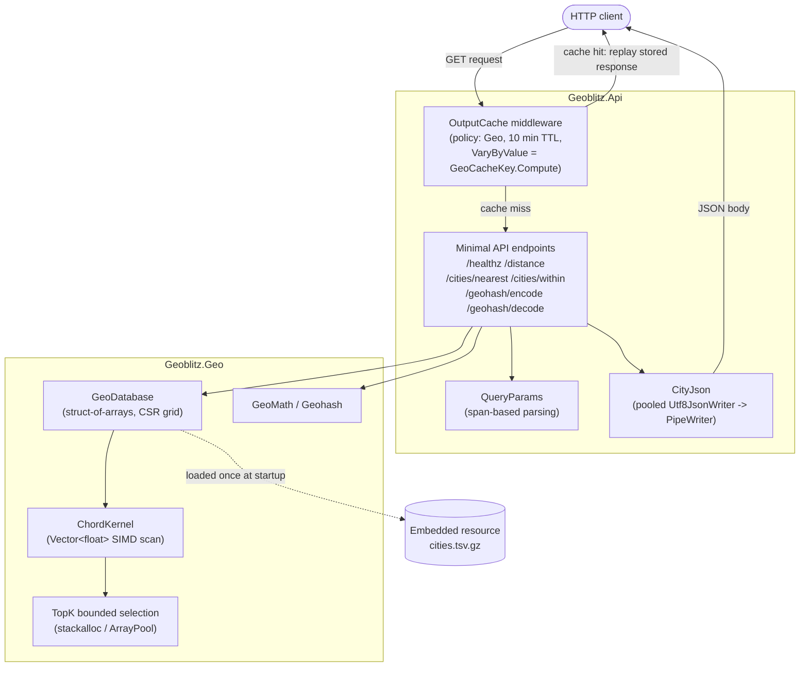

# Architecture

[← Back to docs index](index.md)

## Solution layout

```
Geoblitz.slnx
├── src/
│   ├── Geoblitz.Geo/        # geo index + math library, no ASP.NET Core dependency
│   │   ├── GeoDatabase.cs   # struct-of-arrays city store, grid build, FindWithin/FindNearest
│   │   ├── GeoMath.cs       # Haversine, unit-vector conversion, chord<->km
│   │   ├── ChordKernel.cs   # Vector<float> SIMD distance scans
│   │   ├── TopK.cs          # stackalloc-backed bounded max-heap (ref struct)
│   │   ├── HitBuffer.cs     # ArrayPool-backed growable hit list (unbounded ScanWithin only)
│   │   ├── Geohash.cs       # geohash encode/decode
│   │   ├── CityTableParser.cs / ParsedCities.cs  # gzip TSV -> parallel arrays
│   │   ├── GeoHit.cs        # (Index, DistanceKm) result record struct
│   │   └── Resources/cities.tsv.gz  # embedded GeoNames cities1000 extract (170,584 rows)
│   └── Geoblitz.Api/        # minimal-API host
│       ├── Program.cs       # host setup, output-cache policy, 6 endpoint definitions
│       ├── QueryParams.cs   # span-based query-string parsing
│       ├── GeoCacheKey.cs   # validity-aware, quantized cache-key computation for OutputCache
│       ├── ComputeCounter.cs
│       ├── CityJson.cs      # pooled Utf8JsonWriter -> PipeWriter city serialization
│       └── ApiTypes.cs      # response/problem records + source-generated JsonSerializerContext
├── tests/
│   ├── Geoblitz.Geo.Tests/
│   └── Geoblitz.Api.Tests/  # WebApplicationFactory-based endpoint tests
├── benchmarks/Geoblitz.Benchmarks/   # BenchmarkDotNet suite (see benchmarks/RESULTS.md)
├── loadtest/                # k6 scripts
└── tools/prepare-dataset.ps1
```

`Geoblitz.Geo` has no dependency on ASP.NET Core — it is a plain library that could be
reused by a CLI or a different host. `Geoblitz.Api` references it and adds the HTTP layer.

## Startup flow

`GeoDatabase.LoadDefault()` (called once, at `AddSingleton` registration time in
`Program.cs`) builds the entire in-memory index:

```mermaid
flowchart LR
    A["Embedded resource<br/>cities.tsv.gz"] --> B["GZipStream decompress<br/>CityTableParser.LoadGzip"]
    B --> C["Span-based TSV parse<br/>CityTableParser.Parse<br/>(Utf8Parser, tab-delimited)"]
    C --> D["ParsedCities<br/>(Lat/Lon/Population/Country/NameBlob arrays)"]
    D --> E["Counting sort by grid cell<br/>GeoDatabase ctor"]
    E --> F["Cell-order permutation<br/>(order[] applied to all columns)"]
    F --> G["CSR grid index<br/>CellStart[] + X/Y/Z unit-vector arrays"]
    G --> H["GeoDatabase<br/>(ready, immutable, singleton)"]
```



Each stage avoids allocating more than it must: the TSV is parsed directly from the
decompressed byte span (no per-line string splitting), and the final permutation writes
each column once into its final grid-cell-ordered position (`src/Geoblitz.Geo/GeoDatabase.cs`,
private constructor).

## Component diagram



## Request flow: `GET /cities/nearest`

```mermaid
sequenceDiagram
    participant C as Client
    participant OC as OutputCache middleware
    participant EP as Endpoint (Program.cs)
    participant QP as QueryParams
    participant DB as GeoDatabase
    participant CK as ChordKernel (SIMD)
    participant CJ as CityJson / Utf8JsonWriter

    C->>OC: GET /cities/nearest?lat=..&lon=..&count=5
    OC->>OC: compute cache key via GeoCacheKey.Compute<br/>(validity mask + lat/lon rounded to 3 decimals,<br/>~110 m buckets; invalid input can never share<br/>a key with valid input)
    alt cache hit
        OC-->>C: replay stored response (body + headers,<br/>incl. X-Compute-Count)
    else cache miss
        OC->>EP: forward request
        EP->>QP: TryGetDouble("lat"), TryGetDouble("lon"), TryGetInt("count")
        alt validation fails
            EP-->>C: 400 application/problem+json
        else valid
            EP->>EP: counter.Increment() -> X-Compute-Count header
            EP->>DB: FindNearest(lat, lon, count, stackalloc Span<GeoHit>)
            DB->>DB: ToUnitVector(lat, lon) -> qx, qy, qz
            loop radius expansion (starts 50 km, x4 until k found or half-circumference)
                DB->>DB: GetCandidateRanges -> contiguous CSR [start,end) ranges
                DB->>CK: ScanNearest(X, Y, Z slice, qx, qy, qz, maxChordSq, ref TopK)
                CK-->>DB: TopK updated (stackalloc heap, zero allocation)
            end
            DB->>DB: TopK.CopySortedTo -> sorted GeoHit[]
            DB-->>EP: hit count + Span<GeoHit>
            EP->>CJ: WriteCities(response, db, hits)
            CJ->>CJ: rent pooled Utf8JsonWriter, write to response.BodyWriter,<br/>declare Content-Length (BytesCommitted + BytesPending)
            CJ-->>C: application/json body (count, cities[])
            OC->>OC: store response (body + headers) under quantized key, 10 min TTL
        end
    end
```

## Web console

`web/` is a separate Angular 22 "Flight Deck" console — a local map UI that drives the same
five geo endpoints and surfaces their `Server-Timing`/`X-Compute-Count` headers as a
permanent HUD. It has no server-side component of its own and does not change the API's
request-handling path for any other client. Two hosting modes:

- **Single-origin (showcase mode)**: `tools/publish-web.ps1` builds the Angular production
  bundle and mirrors it into `src/Geoblitz.Api/wwwroot`; `Program.cs` then serves it
  alongside the API from one process, one port (5235), via `UseDefaultFiles`/
  `UseStaticFiles`. Same origin, no CORS.
- **Two-terminal dev mode**: the console runs as its own process (`ng serve`, port 4200)
  against the API (port 5235) over `fetch`, enabled by a Development-only CORS policy in
  `Program.cs`.

See [frontend.md](frontend.md) for its architecture, HUD honesty rules, gesture reference,
and both hosting modes in detail.

## See also

- [Performance techniques](performance-techniques.md) — why each stage above is built the
  way it is, with file:member references and measured numbers.
- [API reference](api.md) — full parameter/response contract for all six endpoints.
- [Benchmarks](benchmarks.md) — how the numbers in this doc and in `benchmarks/RESULTS.md`
  were produced.
- [Frontend](frontend.md) — the Angular map console that consumes this API.
