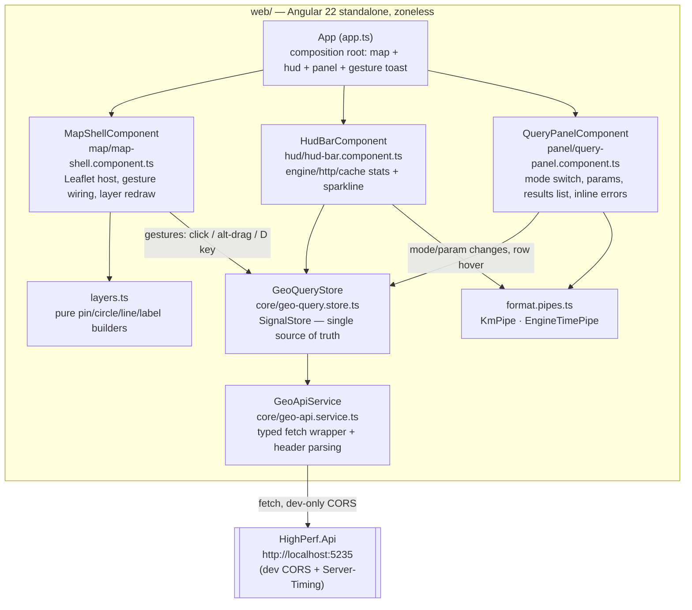

# Frontend — Flight Deck web console

[← Back to docs index](index.md)

## What it is

Flight Deck is an Angular map console for the HighPerf geo API. It is a local
developer/demo tool, not a deployed product: click a point on a real OpenStreetMap map and
watch the API's three query modes — nearest, within-radius, and great-circle distance —
resolve live, with the API's microsecond-scale compute time surfaced as a permanent,
honest HUD (heads-up display) strip rather than buried in a network tab.

Visual direction is "dark mission control": a deep blue-black ground, phosphor-cyan for
query state (the point you clicked, the radius you're dragging), signal-amber for results,
glass panels with a monospace type for all data values. See
`work/specs/2026-08-08-highperf-web-flightdeck-design.md` for the full design rationale.

## Running it

Two processes, two terminals. The API must be running for the web app to show live data.

```bash
# Terminal A — API (from the repo root)
dotnet run -c Release --project src/HighPerf.Api
# listens on http://localhost:5235 (see src/HighPerf.Api/Properties/launchSettings.json)

# Terminal B — web app (first run: npm ci)
cd web
npm start
# ng serve → http://localhost:4200
```

Open `http://localhost:4200` once both are up. The web app talks to the API at a
hardcoded `http://localhost:5235` base URL (`web/src/app/core/models.ts`,
`GEO_API_BASE_URL` injection token) — there is no environment-file switching in v1,
since this is a local console for a local API.

> **Prerelease dependency note:** `web/package.json` pins `@ngrx/signals` to
> `^22.0.0-rc.0` — a release candidate, required because it is the first `@ngrx/signals`
> line to support Angular 22 as a peer dependency. Revisit and bump to the stable 22.x
> release once one ships.

## Architecture

`GeoQueryStore` (`web/src/app/core/geo-query.store.ts`) is the single source of truth.
Every view — map, panel, HUD — reads from its signals and writes back only through its
methods; there is no component-to-component state passing. The three feature components
are deliberately thin: they translate a gesture or form change into a store method call,
or a store signal into markup, and nothing else.



### Two subtle pieces of store logic worth calling out

**Request sequencing.** `GeoQueryStore`'s internal `run()` helper stamps every call with a
monotonically increasing `requestSeq`. If a newer request starts before an older one
resolves — e.g. two rapid clicks — the older response's `apply`/timing/error/`linkDown`
side effects are discarded entirely when it lands, because by then it is no longer
`requestSeq`'s current value. This prevents a slow, stale response from clobbering the
result of a request the user made afterward. `setMode` also bumps the sequence, so a
mode switch mid-flight invalidates whatever was still in flight for the old mode.

**Restart-safe cache-HIT heuristic.** The HUD's `HIT`/`MISS` badge is derived from
`X-Compute-Count`, not a dedicated cache header (the API replaces the originally-planned
`X-Cache` header with `X-Compute-Count` replay semantics — see
[performance-techniques.md, item 8](performance-techniques.md#8-output-caching-with-quantized-keys)).
A `HIT` replays the exact `computeCount` recorded when the entry was cached, which can lag
behind the store's running `maxComputeCount` because unrelated cache misses keep advancing
the counter in the meantime — so the store accepts any `computeCount <= maxComputeCount`
within a margin of 10,000 as a `HIT`. Naively, that rule would also call every request a
permanent `HIT` after a dev-time API restart, since the server-side counter resets to a
small number that trivially satisfies `computeCount <= maxComputeCount` forever. The store
guards against that: a `computeCount` below half of the current `maxComputeCount` is
treated as "the server probably restarted, not a cache hit," reported as a `MISS`, and used
to reset `maxComputeCount`. The accepted trade-off, documented in code
(`geo-query.store.ts`, `pushTiming`): a legitimately very old cached entry whose
`computeCount` happens to sit below half of the current max is misreported as a `MISS`
instead of a `HIT` — judged safer than reporting `HIT` forever after a real restart.

## HUD semantics (honesty rules)

Copied verbatim from the design spec
(`work/specs/2026-08-08-highperf-web-flightdeck-design.md`) — these are the rules the HUD
bar (`web/src/app/hud/hud-bar.component.ts`) is built to enforce:

> - **engine µs**: value of the `Server-Timing: engine;dur=` header — measured inside the
>   API around the compute call only. On a cache HIT the replayed header carries the
>   ORIGINAL compute time; the HUD detects HIT (unchanged `X-Compute-Count`) and displays
>   `cached · 0 µs engine` instead of the stale number, with the original in the tooltip.
>   This distinction is a deliberate teaching artifact.
> - **http ms**: client-measured `performance.now()` around fetch — includes network +
>   Kestrel + serialization. Never conflated with engine time; both always visible.
> - **alloc 0 B**: a static claim from the benchmark suite, labeled as such in a tooltip
>   (linking to docs/benchmarks.md numbers), not a live measurement.
> - Sparkline: last 40 http-ms samples, cyan bars, amber highlight for the max in window.

In the shipped component the `alloc` stat reads `0 B*` (the asterisk is the tell) and its
`title` attribute is literally `"benchmark-suite claim — see docs/benchmarks.md"` — hovering
it is the only way the number explains itself, by design: it is never presented as
something this specific page measured. The cache row reads `cached` in place of the engine
time only when `RequestTiming.cacheHit` is true; otherwise it always shows the real
`EngineTimePipe`-formatted value, never a placeholder.

**Deliberate deviation from the original spec's error grouping:** the design spec grouped all
server-side failures (4xx and 5xx) under one inline-error treatment. The shipped store instead
renders 4xx `ProblemDetails` inline in the panel (the round trip succeeded, so the link is
provably up — see `run()`'s catch branch in `geo-query.store.ts`) and reserves the `LINK DOWN`
HUD state for 5xx responses and network failures, where the link/server itself is the thing
that's actually broken. This distinction was judged more honest than the spec's original
grouping and is tracked as accepted debt (D6) rather than a silent drift.

As a dev-machine anecdote (not a benchmark — the authoritative numbers live in
[benchmarks.md](benchmarks.md)): a nearest-city click during Task 10's live smoke measured
roughly **49 µs** engine time and roughly **14 ms** for the browser's first-paint request
round trip (`dotnet run -c Release`, `ng serve` dev build, one machine, one run). Treat it
as "yes, the HUD's numbers are real and in the expected ballpark," not as a performance
claim.

## Gestures

| Gesture | Precondition | Effect |
|---|---|---|
| Click on the map | mode = `nearest` | `GET /cities/nearest` at the click point (count from the panel); cyan query pin + amber result pins + ranked list |
| Click on the map | mode = `within` | `GET /cities/within` at the click point, using the current radius/min-population from the panel |
| Click on the map | mode = `distance` | Sets the next ruler endpoint; a third click discards the previous pair and starts a new measurement |
| Alt + mouse-down, then drag | any mode | Switches to `within` mode if not already in it; draws a live cyan dashed circle from the anchor to the cursor (local geometry, no request) |
| Release after alt-drag | mode = `within` | `GET /cities/within` at the anchor, with the dragged radius (ignored if the drag was under ~50 m) |
| Radius slider / min-population field (panel) | mode = `within` | Updates `radiusKm` / `minPopulation` and immediately re-runs the query at the last query point (`GeoQueryStore.refresh()`); the slider re-queries on release, its label updates live while dragging |
| Count field (panel) | mode = `nearest` | Updates `count` and immediately re-runs the query at the last query point; the input echoes the clamped value |
| `D` key | any mode, not while focused in an input | Toggles distance mode on/off |
| Hover a result row (panel) | results present | Highlights the matching map pin (grows from r=5 to r=8, brightens) |
| Hover a map pin | results present | Highlights the matching result row — two-way highlight, single source of truth (`GeoQueryStore.highlightedIndex`) |

Count is clamped client-side to `[1, 100]`, radius to `[0.1, 500]` km, min-population to
`>= 0` — the same bounds the API enforces — so the UI cannot construct a request the API
would reject with a 400 (`geo-query.store.ts`, `setCount`/`setRadiusKm`/`setMinPopulation`).

## API additions

Two additions to `src/HighPerf.Api`, both scoped tightly to serve this console without
touching the API's production behavior:

1. **CORS — Development only.** `Program.cs` registers a named `"dev"` CORS policy
   (`WithOrigins("http://localhost:4200")`, any header/method, and
   `WithExposedHeaders("X-Compute-Count", "Server-Timing")` so the browser's `fetch` can
   read those headers cross-origin). It is applied with
   `if (app.Environment.IsDevelopment()) app.UseCors("dev");` — there is no CORS policy at
   all outside Development, so the production deployment story is unchanged. Covered by
   `tests/HighPerf.Api.Tests/CorsTests.cs`: preflight from the dev origin succeeds and
   echoes it back, a simple GET from the dev origin exposes both custom headers, a foreign
   origin gets no CORS headers, and — using a locally pinned `Production` environment
   `WebApplicationFactory` — the dev origin gets no CORS headers outside Development either.
2. **`Server-Timing` header.** `src/HighPerf.Api/ServerTiming.cs` exposes a single
   `ServerTiming.Set(HttpContext, long startTimestamp)` that writes
   `Server-Timing: engine;dur=<ms with 3 decimals>`, computed from
   `Stopwatch.GetElapsedTime(startTimestamp)`. Every one of the five geo endpoints in
   `Program.cs` calls it immediately after its compute call and before writing the response
   body, so it measures the compute section only (not JSON serialization, not the
   `X-Compute-Count` bookkeeping) and — because it is set before the body write —
   `OutputCache` captures and replays it byte-for-byte on a cache hit. Covered by
   `tests/HighPerf.Api.Tests/ServerTimingTests.cs`: the header is present with a
   plausible, correctly formatted value on all five geo endpoints; a cache hit replays the
   exact same header value (and the same `X-Compute-Count`, proving it's a genuine replay,
   not a fresh compute); `/healthz` (uncached, no compute) never gets the header; a 400
   validation failure never gets the header either, since it returns before the compute
   call runs.

## Testing

Vitest covers everything with meaningful logic; nothing else is claimed as tested:

| Spec | Covers |
|---|---|
| `core/geo-query.store.spec.ts` | Mode transitions, param clamping mirroring the API's limits, timing-ring eviction at 40 entries, the HIT/restart heuristic, request sequencing/discard of stale responses, error vs. link-down classification |
| `core/geo-api.service.spec.ts` | URL building for all three calls, `Server-Timing`/`X-Compute-Count` header parsing, `ProblemDetails` parsing into `GeoApiError`, network-failure handling |
| `core/format.pipes.spec.ts` | `KmPipe` (3-decimal km) and `EngineTimePipe` (µs vs. ms threshold) formatting |
| `hud/hud-bar.component.spec.ts` | Idle placeholders, engine time + `MISS · #n` on a fresh compute, `cached` + `HIT · #n` on a repeat query, `LINK DOWN` state |
| `map/layers.spec.ts` | Pure builders only — pin colors/radii/tooltips, radius-circle km→m conversion, ruler line points, distance label text |
| `panel/query-panel.component.spec.ts` | Mode switch buttons, param inputs, inline error rendering |
| `app.spec.ts` | Root composition renders `app-hud-bar` and `app-query-panel` |

**Deliberately untested, by design (per the spec's testing section):**

- `map/map-shell.component.ts` itself — the Leaflet host and its gesture wiring. Each
  handler is a one-line delegation into `GeoQueryStore` (the logic behind every gesture
  lives in, and is tested through, the store and the pure `layers.ts` builders); the glue
  code that attaches Leaflet event listeners to real DOM/canvas elements is exercised by
  manual/Playwright-driven live smoke instead (Task 10: 7 required checks — nearest click,
  repeat-click cache HIT, alt-drag within, ruler distance, client-side clamping, API
  down/recovery — all passed with screenshot evidence, see
  `.superpowers/sdd/2026-08-08-highperf-web-flightdeck/smoke-nearest.png`), because jsdom
  has no real Leaflet map/canvas to click or drag on.
- End-to-end browser tests in CI — out of scope for v1 (design spec, "Out of scope"): this
  is a local console, not a deployed product, and the map-gesture surface is thin enough
  that the live-smoke pass substitutes for it.
- Visual/pixel regression of the Flight Deck theme — no framework for it here; changes are
  eyeballed against the reference mockup.

## See also

- [Architecture](architecture.md) — where the web console sits next to the API in the
  overall system.
- [API reference](api.md) — the endpoints the web console calls.
- [Benchmarks](benchmarks.md) — the authoritative performance numbers; the HUD's `alloc 0 B*`
  tooltip points here, and so does the anecdote above.
